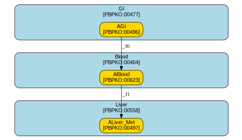

# Carrier2001_Hg_Human

## Overview

| key                          | value                                         |
|:-----------------------------|:----------------------------------------------|
| Modelled species/orgamism(s) | http://purl.obolibrary.org/obo/NCBITaxon_9606 |
| Model chemical(s)            | http://purl.obolibrary.org/obo/CHEBI_25322    |
| Input route(s)               | 1 (oral)                                      |
| Time resolution              | d                                             |
| Amounts unit                 | ug                                            |
| Volume unit                  | L                                             |
| Number of compartments       | 3                                             |
| Number of species            | 3                                             |
| Number of parameters         | 12 (10 external / 2 internal)                 |

## Diagram

## Compartments

| id    | name        | unit   | model qualifier                            |
|:------|:------------|:-------|:-------------------------------------------|
| GI    | Gut tissues | L      | http://purl.obolibrary.org/obo/PBPKO_00477 |
| Liver | Liver       | L      | http://purl.obolibrary.org/obo/PBPKO_00558 |
| Blood | Blood       | L      | http://purl.obolibrary.org/obo/PBPKO_00464 |

## Species

| id         | name                        | unit   | model qualifier                            |
|:-----------|:----------------------------|:-------|:-------------------------------------------|
| AGI        | Amount of chemical in gut   | ug     | http://purl.obolibrary.org/obo/PBPKO_00496 |
| ABlood     | Amount of chemical in blood | ug     | http://purl.obolibrary.org/obo/PBPKO_00623 |
| ALiver_Met | Metabolite in liver         | ug     | http://purl.obolibrary.org/obo/PBPKO_00058 |

## Transfer equations

| id   | from   | to         | equation                                              |
|:-----|:-------|:-----------|:------------------------------------------------------|
| _J0  | AGI    | ABlood     | $ \mathit{kabs}\cdot \mathit{AGI}\cdot \mathit{Frac}$ |
| _J1  | ABlood | ALiver_Met | $ \mathit{ABlood}\cdot \mathit{kmet_{liver}}$         |

## ODEs

$\frac{d[\mathtt{AGI}]}{dt} = -  \mathit{kabs}\cdot \mathit{AGI}\cdot \mathit{Frac}$

$\frac{d[\mathtt{ABlood}]}{dt} =  \mathit{kabs}\cdot \mathit{AGI}\cdot \mathit{Frac}
               -  \mathit{ABlood}\cdot \mathit{kmet_{liver}}$

$\frac{d[\mathtt{ALiver-Met}]}{dt} =  \mathit{ABlood}\cdot \mathit{kmet_{liver}}$

## Assignment rules

$CGI =  \frac{\mathit{AGI}}{\mathit{GI}}$

$CBlood =  \frac{\mathit{ABlood}}{\mathit{Blood}}$

## Initial assignments

$GI =  \mathit{VGI}$

$Liver =  \mathit{VL}$

$Blood =  \mathit{VB}$

$VB =  \mathit{VBc}\cdot \mathit{BW}$

$VGI =  \mathit{VGIc}\cdot \mathit{BW}$

$VL =  \mathit{VLc}\cdot \mathit{BW}$

## Parameters

| id         | name                               | unit          | model qualifier                            |
|:-----------|:-----------------------------------|:--------------|:-------------------------------------------|
| BW         | Bodyweight                         | kg            | http://purl.obolibrary.org/obo/PBPKO_00008 |
| VGIc       | Volume fraction of gut             | dimensionless | http://purl.obolibrary.org/obo/PBPKO_00509 |
| VBc        | Volume fraction of blood           | dimensionless | http://purl.obolibrary.org/obo/PBPKO_00610 |
| VLc        | Volume fraction of liver           | dimensionless | http://purl.obolibrary.org/obo/PBPKO_00078 |
| VB         | Volume of blood                    | L             | http://purl.obolibrary.org/obo/PBPKO_00108 |
| VGI        | Volume of gut                      | L             | http://purl.obolibrary.org/obo/PBPKO_00524 |
| VL         | Volume of liver                    | L             | http://purl.obolibrary.org/obo/PBPKO_00077 |
| kabs       | Absorption rate                    | /d            | http://purl.obolibrary.org/obo/PBPKO_00141 |
| Frac       | Bioavailability                    | dimensionless | http://purl.obolibrary.org/obo/PBPKO_00263 |
| kmet_liver | Hepatic metabolism rate            | /d            | http://purl.obolibrary.org/obo/PBPKO_00234 |
| CGI        | Concentration of chemical in gut   | ug/L          | http://purl.obolibrary.org/obo/PBPKO_00538 |
| CBlood     | Concentration of chemical in blood | ug/L          | http://purl.obolibrary.org/obo/PBPKO_00301 |

## Creators

*not specified*

